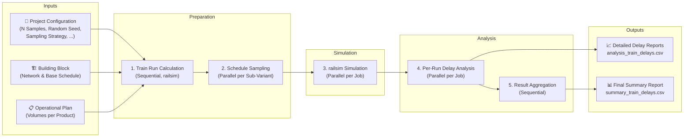

# MATSim Railsim Experiments

This project provides a configurable command-line tool for running railway simulations with `railsim` (a MATSim
contrib). It is designed to analyze and compare the performance of different infrastructure layouts (**Building Blocks
**) under consistent traffic scenarios (**Operational Plans**).

The project is structured around **Use Cases**. A Use Case groups a set of related Building Blocks and defines a single
Operational Plan compatible with all of them, ensuring a consistent basis for comparison.

## Glossary

The simulation is structured around these three key concepts, from general to specific:

* **Use Case**: Concept that groups a set of related **Building Blocks** and defines a single **Operational Plan** that
  is compatible with every Building Block within it. This ensures consistent operational logic across different
  infrastructure variations. For example, all train lines (for products like FV, RV, GV) defined in the plan must follow
  the same fundamental sequence of potential stops, even if individual trains don't service every stop.
* **Building Block**: A specific infrastructure scenario. It defines the physical railway network (tracks and block
  resources) and a template transit schedule (routes and stops), but does not contain specific departure times on the
  routes. It is defined by a set of MATSim XML files (`network.xml`, `schedule.xml`, and `vehicles.xml`).
* **Operational Plan**: A generic timetable (`Mengengerüst`) that specifies the desired train volumes. It defines how
  many trains of each product type (e.g., FV, RV, GV) should run between origin-destination pairs within a given period.
  It is provided as a JSON file with hierarchical structure that allows for defining different operational concepts,
  variants, and sub-variants.

## Simulation Pipeline

The automated pipeline proceeds from configuration, simulation to analysis for each Building Block combined with all
sub-variants of the Operational Plan.



1. **Train Run Calculation**: Minimum, unconstrained travel times are calculated for each route in the base schedule of
   the Building Block using the MATSim `railsim` engine.
2. **Schedule Sampling**: Departure times are generated based on the train volumes from the Operational Plan. This step
   creates *n* schedule samples following a sampling strategy (RANDOM or HEADWAY).
3. **Railsim Simulation**: Each schedule sample is run through the MATSim `railsim` engine on the constrained network of
   the Building Block where rerouting is enabled.
4. **Delay Analysis**: Delays (departure and arrival) are calculated for every train at each stop.
5. **Result Aggregation**: Delay data is aggregated into a summary report showing the cumulative arrival delays of all
   trains at the terminal stop for each run.

## Operational Plan Structure

```json
{
  "operationalPlan": [
    {
      "name": "KM",
      "description": "Kernnetz-Mischbetrieb",
      "variants": [
        {
          "id": "KM1",
          "distribution": [
            {
              "product": "FV",
              "share": 0.4
            },
            {
              "product": "RV",
              "share": 0.5
            },
            {
              "product": "GV",
              "share": 0.1
            }
          ],
          "subVariants": [
            {
              "id": "KM1.1",
              "trainVolumes": [
                {
                  "product": "FV",
                  "fromStop": "L1",
                  "toStop": "R1",
                  "amount": 3
                },
                {
                  "product": "RV",
                  "fromStop": "L1",
                  "toStop": "R1",
                  "amount": 4
                },
                {
                  "product": "GV",
                  "fromStop": "L1",
                  "toStop": "R1",
                  "amount": 1
                }
              ]
            }
          ]
        }
      ]
    }
  ]
}
```

## Output Structure

All simulation results are written to a structured output directory.

```txt
 <output_directory>/
    ├── output_project_config.json
    └── <use_case_name>/
        └── <building_block_name>/
            ├── 01_train_run_calculation/
            ├── 02_schedule_sampling/
            ├── 03_simulation_job_config/
            ├── 04_simulation_run_output/
            └── 05_analysis/
                ├── <sub_variant_id>/
                │   └── <run_id>/
                │       └── analysis_train_delays.csv
                └── summary_train_delays.csv
```

## Running the Simulation

The simulation can be launched from command line or by running the `org.matsim.project.RunRailsimScenario` class with
program arguments in an IDE.

### Parameters

| Flag                         | Description                                                        | Default  | Required |
|------------------------------|--------------------------------------------------------------------|----------|:--------:|
| `--output`                   | Output directory for simulation results.                           |          |   Yes    |
| `--building-blocks`          | Comma-separated list of building blocks (e.g., `UC1_BB1,UC1_BB2`). | `*`      |          |
| `-s`, `--samples`            | Number of samples per sub-variant.                                 | `5`      |          |
| `-h`, `--hours`              | Simulation duration in hours.                                      | `3`      |          |
| `-d`, `--departure-sampling` | Departure sampling strategy. (`RANDOM` or `HEADWAY`)               | `RANDOM` |          |
| `-l`, `--matsim-log-level`   | MATSim log level. (`INFO`, `WARN`, `ERROR`, `DEBUG`)               | `INFO`   |          |
| `--overwrite`                | Overwrite the output directory if it exists.                       | `false`  |          |

### Example Execution

```sh
ARGS_ARRAY=(
--output "/path/to/your/output_directory"
--building-blocks "UC1_BB1,UC1_BB2,UC1_BB3,UC1_BB4"
--samples "5"
--hours "3"
--departure-sampling "RANDOM"
--matsim-log-level "WARN"
--overwrite
)

./mvnw exec:java -Dexec.args="${ARGS_ARRAY[*]}"
```

## Licenses

- **Source Code**: The Java source code in the `src` directory is licensed under
  the [GNU General Public License v2.0](https://www.gnu.org/licenses/old-licenses/gpl-2.0.en.html).
- **Data and Visualizations**: All input files, output files, and analysis data are licensed under
  the [Creative Commons Attribution 4.0 International License](http://creativecommons.org/licenses/by/4.0/).

[](http://creativecommons.org/licenses/by/4.0/)
