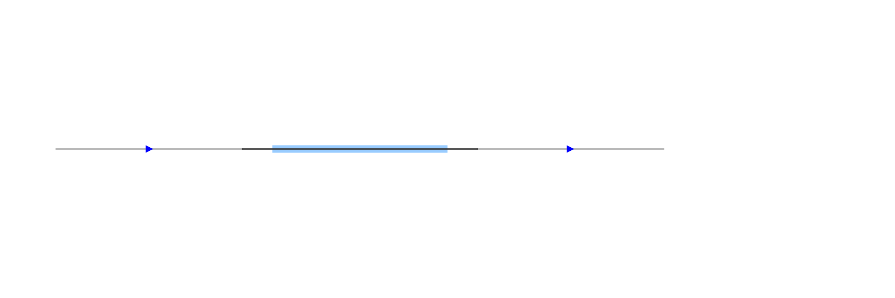
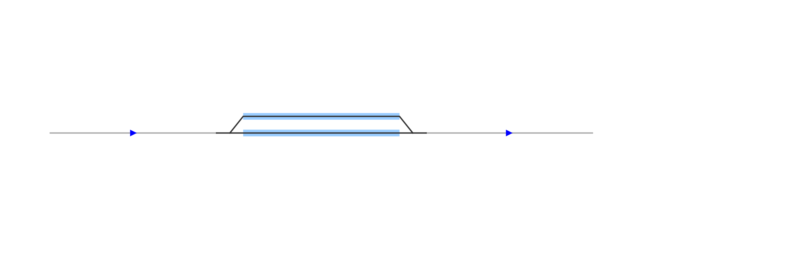
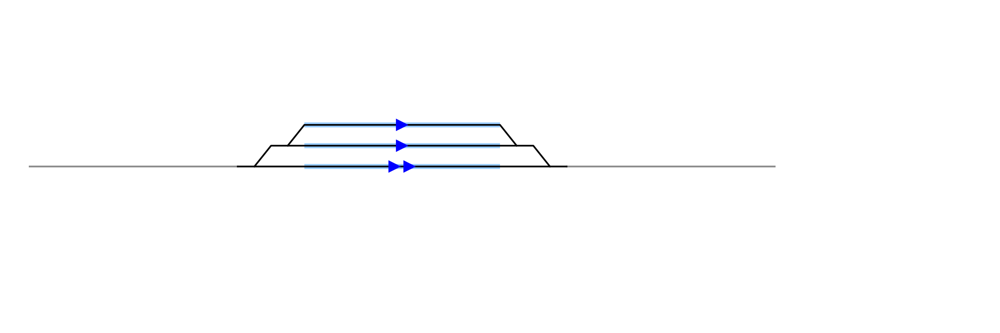
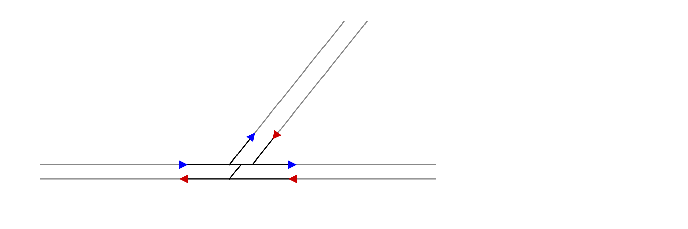
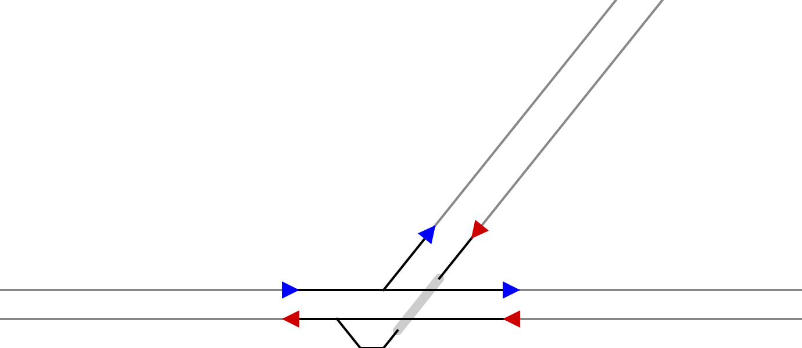
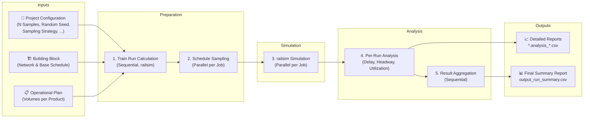

# MATSim Railsim Experiments

This project provides a configurable command-line tool for running railway simulations with `railsim` (a MATSim
contrib). It is designed to analyze and compare the performance of different infrastructure layouts
(**Building Blocks**) under consistent traffic Operating Modes (**Operational Plans**).

The project is structured around **Use Cases**. A Use Case groups a set of related Building Blocks and defines a single
Operational Plan compatible with all of them, ensuring a consistent basis for comparison.

## Glossary

The simulation is structured around these three key concepts, from general to specific:

* **Use Case**: Concept that groups a set of related **Building Blocks** and defines a single **Operational Plan** that
  is compatible with every Building Block within it. This ensures consistent operational logic across different
  infrastructure variations. For example, all train lines (for products like FV, RV, GV) defined in the plan must follow
  the same fundamental sequence of potential stops, even if individual trains don't service every stop.
* **Building Block**: A specific infrastructure setup. It defines the physical railway network (tracks and block
  resources) and a template transit schedule (routes and stops), but does not contain specific departure times on the
  routes. It is defined by a set of MATSim XML files (`network.xml`, `schedule.xml`, and `vehicles.xml`).
* **Operational Plan**: A generic timetable (*Mengengerüst*) that specifies the desired train volumes. It defines how
  many trains of each product type (e.g., FV, RV, GV) should run on specific, pre-defined traffic flows (mapped to
  MATSim routes) within a given period. It is provided as a JSON file with hierarchical structure.

## Building Block Overview

This table provides an overview of the available infrastructure layouts.

| Layout                                                                                                                                                             | Use Case             | Building Block                               |
|:-------------------------------------------------------------------------------------------------------------------------------------------------------------------|:---------------------|:---------------------------------------------|
| [](src/main/resources/scenarios/use_case_0/building_block_1/model.svg) | **UC0**: Calibration | **BB1**: Fixed Blocks                        |
| [](src/main/resources/scenarios/use_case_0/building_block_2/model.svg) | **UC0**: Calibration | **BB2**: Moving Blocks                       |
| [](src/main/resources/scenarios/use_case_1/building_block_1/model.svg) | **UC1**: Station     | **BB1**: 1 Through track + 1 Platform track  |
| [](src/main/resources/scenarios/use_case_1/building_block_2/model.svg) | **UC1**: Station     | **BB2**: 1 Through track + 2 Platform tracks |
| [](src/main/resources/scenarios/use_case_1/building_block_3/model.svg) | **UC1**: Station     | **BB3**: 1 Through track + 3 Platform tracks |
| [](src/main/resources/scenarios/use_case_2/building_block_1/model.svg) | **UC2**: Crossing    | **BB1**: Flat Junction                       |
| [](src/main/resources/scenarios/use_case_2/building_block_2/model.svg) | **UC2**: Crossing    | **BB2**: Grade Separation                    |

## Simulation Pipeline

The automated pipeline proceeds from configuration, simulation, to analysis for each simple Building Block combined with
all Operating Modes defined in the Operational Plan.



1. **Train Run Calculation**: Minimum, unconstrained travel times are calculated for each route in the base schedule of
   the Building Block using the MATSim `railsim` engine.
2. **Schedule Sampling**: Departure times are generated based on the train volumes from the Operational Plan. This step
   creates *n* schedule samples following a sampling strategy (RANDOM or HEADWAY).
3. **Railsim Simulation**: Each schedule sample is run through the MATSim `railsim` engine on the constrained network of
   the Building Block where rerouting is enabled.
4. **Analysis**: Delays (departure and arrival), headways (time between trains), and building block utilization are
   calculated for every run.
5. **Result Aggregation**: Key metrics are aggregated into a summary report for each run to facilitate comparison.

## Operational Plan Structure

The Operational Plan is built using the following concepts:

* **Traffic Flow**: A logical connection between two points in the network (e.g., "Trunk A-B"). The flow maps this
  abstract concept to the physical **Route IDs** (`forward` and `reverse`) defined per product in the Building Block's
  schedule.
* **Flow Pattern**: Defines the traffic distribution of a product on flows. For example, a `BALANCED` pattern might
  distribute traffic 50/50 between two branches, while a `TRUNK_ONLY` pattern routes everything onto the main line.
* **Product Mix**: Defines the ratio of different train types (e.g., "40% Intercity, 40% Regional, 20% Cargo").
* **Scenario Definition**: The top-level configuration. It pairs a **Product Mix** with one or more **Flow Patterns**.
  The generator creates an **Operating Mode** for every valid combination of mix and pattern defined here.
* **Volumes**: Defines the global scaling of traffic for each defined scenario. The simulation pipeline iterates from
  `min` to `max` total trains per `period` and samples `n` simulation jobs for each volume level.

JSON structure:

```json
{
  "volumes": {
    "period": 1800,
    "min": 4,
    "max": 12,
    "step": 1,
    "bidirectional": false
  },
  "products": {
    "FV": {
      "description": "Fernverkehr",
      "minHeadway": 120
    },
    "RV": {
      "description": "Regionalverkehr",
      "minHeadway": 90
    },
    "GV": {
      "description": "Güterverkehr",
      "minHeadway": 180
    }
  },
  "flows": {
    "LMR": {
      "description": "Verkehrsstrom mit Halt bei M (L-M-R)",
      "routes": {
        "FV": {
          "forward": "FV_LMR"
        },
        "RV": {
          "forward": "RV_LMR"
        }
      }
    },
    "LR": {
      "description": "Verkehrsstrom ohne Halt bei M (L-R)",
      "routes": {
        "FV": {
          "forward": "FV_LR"
        },
        "GV": {
          "forward": "GV_LR"
        }
      }
    }
  },
  "patterns": {
    "FV_PASS": {
      "description": "FV direkt; RV hält; GV direkt",
      "shares": {
        "FV": {
          "LR": 1.0
        },
        "RV": {
          "LMR": 1.0
        },
        "GV": {
          "LR": 1.0
        }
      }
    },
    "FV_STOP": {
      "description": "FV hält; RV hält; GV direkt",
      "shares": {
        "FV": {
          "LMR": 1.0
        },
        "RV": {
          "LMR": 1.0
        },
        "GV": {
          "LR": 1.0
        }
      }
    }
  },
  "mixes": {
    "MAINLINE": {
      "description": "Kernnetz-Mischverkehr (Ref: Lausanne–Genf)",
      "shares": {
        "FV": 0.4,
        "RV": 0.4,
        "GV": 0.2
      }
    },
    "TRANSIT": {
      "description": "Transit-Korridor Güter/Fernverkehr (Ref: Lugano)",
      "shares": {
        "FV": 0.5,
        "GV": 0.5
      }
    }
  },
  "modes": [
    {
      "mix": "MAINLINE",
      "patterns": [
        "FV_PASS",
        "FV_STOP"
      ]
    },
    {
      "mix": "TRANSIT",
      "patterns": [
        "FV_STOP"
      ]
    }
  ]
}
```

## Output Structure

All simulation results are written to a structured output directory.

```txt
 <output_directory>/
    ├── output_project_config.json
    ├── output_run_info.json
    ├── output_run_summary.csv (or output_reconstruct_summary.csv)
    └── <use_case_name>/
        └── <building_block_name>/
            ├── 01_train_run_calculation/
            ├── 02_schedule_sampling/
            │   └── mainline_fv_pass/
            │       └── volume_10/
            │           └── sample_1/
            ├── 03_simulation_job_config/
            │   └── mainline_fv_pass/
            │       └── volume_10/
            ├── 04_simulation_run_output/
            │   └── mainline_fv_pass/
            │       └── volume_10/
            │           └── <run_id>/
            └── 05_analysis/
                └── mainline_fv_pass/
                    └── volume_10/
                        └── <run_id>/
                            ├── <run_id>.analysis_train_delays.csv
                            ├── <run_id>.analysis_minimum_headways.csv
                            └── <run_id>.analysis_utilization.csv
```

## Running the Simulation

The simulation can be launched from the command line or by running the `org.matsim.project.RunRailsimScenario` class
with program arguments in an IDE. The CLI supports two main commands:

* `run`: Executes new experiments with specified Building Blocks and parameters.
* `reconstruct`: Re-runs specific scenarios based on an existing configuration. This is particularly useful if the
  original run was executed with the `--cleanup` option (deleting raw simulation outputs), but you later need the
  detailed simulation output files for specific runs to investigate an issue.

### Run Command

Executes a new simulation experiment.

| Flag                         | Description                                                                | Default  | Required |
|------------------------------|----------------------------------------------------------------------------|----------|:--------:|
| `-o`, `--output`             | Output directory for simulation results.                                   |          |   Yes    |
| `-b`, `--building-blocks`    | Comma-separated list of Building Blocks (e.g., `UC1_BB1,UC1_BB2`), or `*`. | `*`      |          |
| `-s`, `--samples`            | Number of samples per Operating Mode.                                      | `5`      |          |
| `-t`, `--simulation-time`    | Total simulation time in seconds.                                          | `10800`  |          |
| `-a`, `--analysis-start`     | Start time of the analysis window in seconds (excludes warm-up).           | `3600`   |          |
| `-A`, `--analysis-duration`  | Duration of the analysis window in seconds.                                | `3600`   |          |
| `-w`, `--worker-threads`     | Number of worker threads (default is number of cores).                     | `-1`     |          |
| `-d`, `--departure-sampling` | Departure sampling strategy. (`RANDOM` or `HEADWAY`)                       | `RANDOM` |          |
| `--cleanup`                  | Delete run outputs after analysis to save space.                           | `false`  |          |
| `--overwrite`                | Overwrite the output directory if it exists.                               | `false`  |          |

### Reconstruct Command

Reconstructs specific runs based on an existing configuration.

| Flag                     | Description                                            | Default | Required |
|--------------------------|--------------------------------------------------------|---------|:--------:|
| `-p`, `--path`           | Existing project root path containing the config file. |         |   Yes    |
| `-r`, `--runs`           | Comma-separated specific Run IDs to re-run.            |         |   Yes    |
| `-w`, `--worker-threads` | Number of worker threads.                              | `-1`    |          |

### Example Execution

#### Running a New Experiment

```sh
# reduce MATSim verbosity
MATSIM_LOG_LEVEL='ERROR'

# program arguments
ARGS_ARRAY=(
    run
    --output "/path/to/your/output_directory"
    --building-blocks "UC1_BB1,UC1_BB2"
    --samples "5"
    --simulation-time "10800"
    --cleanup
    --overwrite
)

./mvnw exec:java -Dmatsim.log.level=${MATSIM_LOG_LEVEL} -Dexec.args="${ARGS_ARRAY[*]}"
```

#### Reconstructing Runs

```sh
ARGS_ARRAY=(
    reconstruct
    --path "/path/to/existing/experiment"
    --runs "uc1_bb1_mainline_fv_pass_volume_10_sample_1,uc1_bb1_mainline_fv_pass_volume_10_sample_2"
)

./mvnw exec:java -Dmatsim.log.level=${MATSIM_LOG_LEVEL} -Dexec.args="${ARGS_ARRAY[*]}"
```

## Licenses

- **Source Code**: The Java source code in the `src` directory is licensed under
  the [GNU General Public License v2.0](https://www.gnu.org/licenses/old-licenses/gpl-2.0.en.html).
- **Data and Visualizations**: All input files, output files, and analysis data are licensed under
  the [Creative Commons Attribution 4.0 International License](http://creativecommons.org/licenses/by/4.0/).

[](http://creativecommons.org/licenses/by/4.0/)
